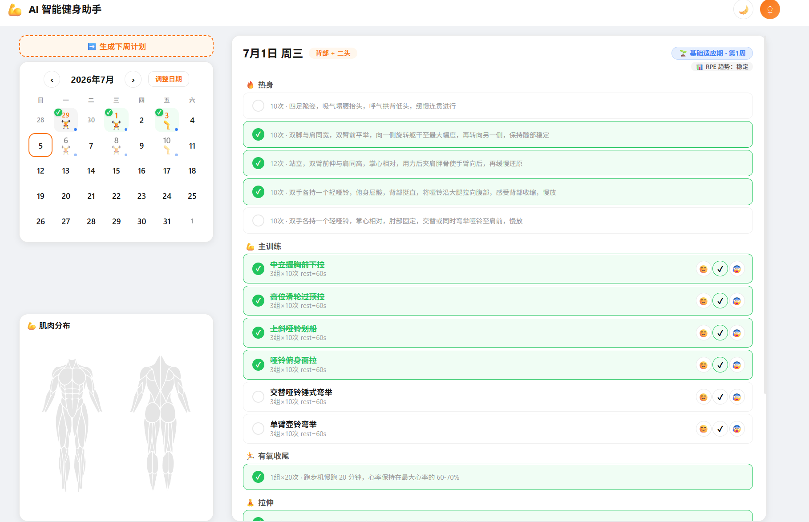
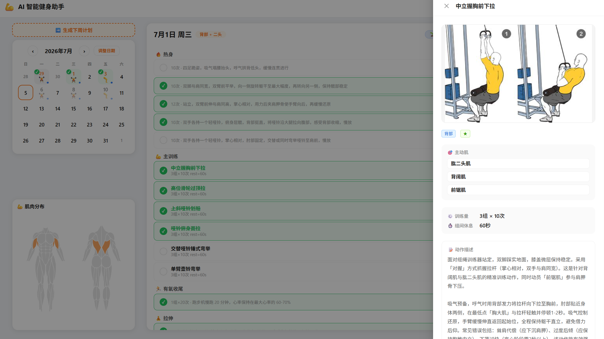
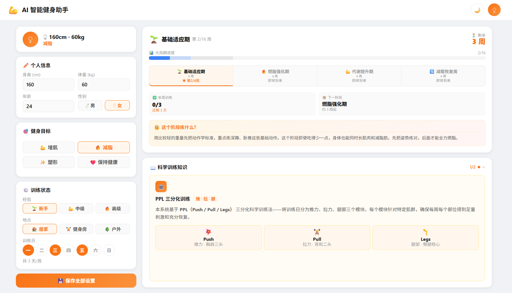
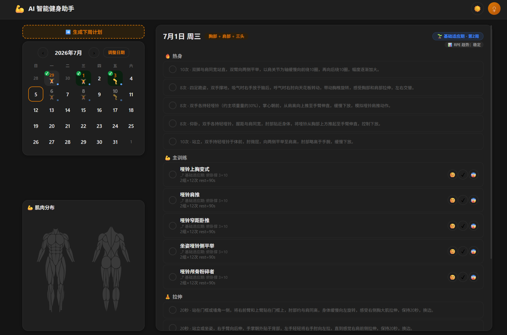

# Fitness Plan 🏋️‍♂️

<p align="center">
  <strong>AI 驱动个性化健身计划生成器</strong><br>
  多 Agent 协作 · 健身科学引擎 · wger 集成 · Vue 3 日历界面
</p>

<p align="center">
  
</p>

---

## 📋 目录

- [功能特色](#-功能特色)
- [在线体验](#-在线体验)
- [技术栈](#-技术栈)
- [项目结构](#-项目结构)
- [本地开发](#-本地开发)
- [部署指南](#-部署指南)
  - [后端 — Render 部署](#后端--render-部署)
  - [前端 — Vercel 部署](#前端--vercel-部署)
- [环境变量](#-环境变量)
- [API 概览](#-api-概览)
- [技术亮点](#-技术亮点)
- [许可证](#-许可证)

---

## 📸 界面预览


*动作详情 — 肌肉高亮图解、动作要领、训练建议*


*个人资料 — 健身目标、经验水平、训练日程设置*


*夜间模式 — 深色主题，护眼舒适*

---

## ✨ 功能特色

| 功能 | 说明 |
|------|------|
| 🧠 **AI 智能生成** | 基于用户目标、经验、日程，通过多 Agent 协作生成个性化训练计划 |
| 📅 **日历主页** | 月历视图 + 日计划详情，每日训练内容一目了然 |
| ✅ **训练打卡** | 逐动作勾选完成，记录训练进度 |
| 📊 **渐进超负荷** | 自动计算建议重量，动作进阶提示，持续进步 |
| 🔄 **动作轮换** | 科学轮换动作类型，避免平台期 |
| 🏋️ **wger 集成** | 接入开源健身数据库，获取专业动作库与肌肉图解 |
| 📋 **动作详情** | 查看动作描述、目标肌群、动作要领、部位高亮图解 |
| 🎯 **个性化引导** | 三步设置向导（个人资料 → 健身目标 → 训练日程） |
| 🌙 **夜间模式** | 深色主题，护眼舒适 |
| 💬 **AI 对话** | 内置 AI 助手，随时解答训练疑问 |

---

## 🌐 在线体验

| 服务 | 地址 |
|------|------|
| **前端（Vercel）** | [https://fitness-plan-psi.vercel.app](https://fitness-plan-psi.vercel.app) |
| **后端 API（Render）** | [https://fitness-plan-lm3y.onrender.com](https://fitness-plan-lm3y.onrender.com) |
| **API 文档（Swagger）** | [https://fitness-plan-lm3y.onrender.com/docs](https://fitness-plan-lm3y.onrender.com/docs) |

---

## 🛠 技术栈

| 层级 | 技术 |
|------|------|
| **后端框架** | Python [FastAPI](https://fastapi.tiangolo.com/) |
| **Agent 框架** | [HelloAgents](https://github.com/HelloAgents/hello-agents) |
| **前端框架** | [Vue 3](https://vuejs.org/) + TypeScript |
| **UI 组件库** | [Ant Design Vue](https://next.antdv.com/) 4.x |
| **状态管理** | [Pinia](https://pinia.vuejs.org/) |
| **构建工具** | [Vite](https://vitejs.dev/) 6.x |
| **ORM / 数据库** | SQLAlchemy + SQLite |
| **健身数据库** | [wger](https://wger.de/) (开源健身数据 MCP 服务) |
| **LLM** | OpenAI 兼容 API（如 DeepSeek） |
| **部署** | Render（后端）+ Vercel（前端） |

---

## 📁 项目结构

```
fitness-plan/
├── backend/                    ← FastAPI 后端
│   ├── run.py                  → 启动入口
│   ├── app/
│   │   ├── config.py           → 配置管理（端口/LLM/CORS）
│   │   ├── database.py         → SQLAlchemy 初始化
│   │   ├── models/
│   │   │   ├── orm_models.py   → 数据库表模型
│   │   │   └── schemas.py      → Pydantic schema
│   │   ├── api/
│   │   │   ├── main.py         → FastAPI 应用 + 路由注册
│   │   │   └── routes/
│   │   │       ├── fitness.py  → /api/fitness/*（计划生成/查询）
│   │   │       ├── record.py   → /api/record/*（打卡记录）
│   │   │       ├── user.py     → /api/user/*（用户资料）
│   │   │       └── wger.py     → /api/wger/*（动作查询）
│   │   ├── agents/
│   │   │   ├── plan_agent.py   → 训练计划组装 Agent
│   │   │   └── exercise_agent.py → wger 动作搜索 Agent
│   │   ├── engine/             → 健身科学引擎
│   │   │   ├── generator.py           → 计划生成
│   │   │   ├── adaptive_adjustment.py → 自适应调整
│   │   │   ├── progressive_overload.py → 渐进超负荷
│   │   │   ├── exercise_rotation.py   → 动作轮换
│   │   │   ├── exercise_cache.py      → wger 本地缓存
│   │   │   └── mesocycle_manager.py   → 中周期管理
│   │   └── services/
│   │       ├── llm_service.py  → LLM 调用
│   │       ├── plan_service.py → 计划业务编排
│   │       └── wger_service.py → wger 封装
│   ├── requirements.txt
│   ├── render.yaml             → Render 部署配置
│   └── .env                    → 本地环境变量（不提交）
│
├── frontend/                   ← Vue 3 前端
│   ├── package.json
│   ├── vite.config.ts          → Vite + 代理配置
│   ├── src/
│   │   ├── main.ts             → Vue 入口
│   │   ├── App.vue             → 根组件
│   │   ├── views/
│   │   │   ├── MainPage.vue          → 日历主页（核心）
│   │   │   ├── OnboardingGuide.vue   → 三步引导
│   │   │   ├── SetupWizard.vue       → 快速设置
│   │   │   ├── GeneratingPlan.vue    → 生成等待页（SSE 流）
│   │   │   └── ProfilePage.vue       → 用户资料页
│   │   ├── components/
│   │   │   ├── CalendarPanel.vue     → 日历面板
│   │   │   ├── DayCell.vue           → 单日单元格
│   │   │   ├── DailyPlanPanel.vue    → 日计划详情
│   │   │   ├── ExerciseRow.vue       → 动作行（打卡）
│   │   │   ├── ExerciseDrawer.vue    → 动作详情 Drawer
│   │   │   ├── StepCard*.vue         → 引导步骤
│   │   │   ├── TodayCard.vue         → 今日概览
│   │   │   ├── CycleInfo.vue         → 周期信息
│   │   │   └── AIChatPanel.vue       → AI 对话
│   │   ├── stores/
│   │   │   ├── user.ts        → 用户状态
│   │   │   ├── workout.ts     → 训练状态
│   │   │   └── cycle.ts       → 周期状态
│   │   ├── services/
│   │   │   ├── api.ts         → Axios HTTP 客户端
│   │   │   └── sse.ts         → SSE 流式接收
│   │   └── types/index.ts     → TypeScript 类型
│   └── .env.example
│
├── screenshots/                ← 项目截图
├── CLAUDE.md                   ← Claude Code 项目上下文
└── README.md                   ← 本文件
```

> `0-docs/`、`test/`、`wger-mcp-server/` 等目录为开发辅助，仅保留在本地，不推送至 main 分支。

---

## 🚀 本地开发

### 前置条件

- Python 3.10+
- Node.js 18+
- 一个 OpenAI 兼容的 LLM API Key（如 [DeepSeek](https://platform.deepseek.com/)）

### 1. 克隆仓库

```bash
git clone https://github.com/penelope1234564867/fitness-plan.git
cd fitness-plan
```

### 2. 启动后端

```bash
cd backend

# 创建虚拟环境
python -m venv venv
source venv/bin/activate  # Windows: venv\Scripts\activate

# 安装依赖
pip install -r requirements.txt

# 配置环境变量（复制并填入你的 API Key）
cp .env.example .env
# 编辑 .env，填入 LLM_API_KEY 等配置

# 启动后端（热重载）
python run.py
```

后端运行在 **http://localhost:8000**，API 文档在 **http://localhost:8000/docs**。

### 3. 启动前端

```bash
cd frontend

# 安装依赖
npm install

# 启动开发服务器
npm run dev
```

前端运行在 **http://localhost:5173**，Vite 会自动将 `/api` 请求代理到后端。

### 4. 运行测试

```bash
# 前端测试
cd frontend && npm test

# 后端端到端测试
cd backend && python ../test/06_plan_agent_assembly.py
```

---

## 📦 部署指南

项目采用前后端分离部署：

- **后端** → [Render](https://render.com/)（免费云托管）
- **前端** → [Vercel](https://vercel.com/)（免费云托管）

### 后端 — Render 部署

`backend/render.yaml` 已预配置好部署参数，支持两种方式：

#### 方式 A：一键部署（推荐）

[](https://render.com/deploy?repo=https://github.com/penelope1234564867/fitness-plan)

点击上方按钮，Render 会自动读取 `backend/render.yaml` 进行部署。

#### 方式 B：手动配置

1. 登录 [Render Dashboard](https://dashboard.render.com/)
2. 点击 **New + → Web Service**
3. 连接你的 GitHub 仓库，选择 `backend/` 目录
4. 填写配置：

| 配置项 | 值 |
|--------|-----|
| **Name** | `fitness-plan-api` |
| **Runtime** | `Python` |
| **Build Command** | `pip install -r requirements.txt` |
| **Start Command** | `uvicorn app.api.main:app --host 0.0.0.0 --port $PORT` |
| **Health Check Path** | `/health` |
| **Plan** | `Free` |

5. 在 **Environment Variables** 中添加：

| 变量 | 说明 |
|------|------|
| `LLM_API_KEY` | 🔒 LLM API Key（从 Dashboard 手动输入） |
| `LLM_MODEL_ID` | `deepseek-v4-flash` |
| `LLM_BASE_URL` | `https://api.deepseek.com` |
| `LLM_TIMEOUT` | `60` |
| `HOST` | `0.0.0.0` |
| `LOG_LEVEL` | `INFO` |

> Render 会自动分配 `PORT` 环境变量，覆盖配置中的 `8000`。

### 前端 — Vercel 部署

1. 登录 [Vercel Dashboard](https://vercel.com/)
2. 点击 **Add New → Project**
3. 导入你的 GitHub 仓库
4. **Root Directory** 选择 `frontend/`
5. **Framework Preset** 选择 `Vite`
6. 在 **Environment Variables** 中添加：

| 变量 | 值 |
|------|-----|
| `VITE_API_BASE_URL` | 你的 Render 后端地址，如 `https://fitness-plan-lm3y.onrender.com` |

7. 点击 **Deploy**

> **重要：** 部署后需在 Vercel 项目 Settings 中关闭 **Vite Dev Mode**，确保生产构建正常。

### 部署后配置

代码合入 `main` 分支后，Render 和 Vercel 会自动触发重新部署。

---

## 🔐 环境变量

### 后端 (`backend/.env`)

```env
# LLM 配置
LLM_MODEL_ID=deepseek-v4-flash
FAST_LLM_MODEL_ID=deepseek-v4-flash
LLM_API_KEY=your-api-key-here
LLM_BASE_URL=https://api.deepseek.com
LLM_TIMEOUT=60

# 服务器配置
HOST=0.0.0.0
PORT=8000

# 日志级别
LOG_LEVEL=INFO
```

### 前端 (`frontend/.env`)

```env
# 后端 API 地址（开发环境用 localhost，生产环境用 Render 地址）
VITE_API_BASE_URL=http://localhost:8000

# 高德地图 API Key（可选）
VITE_AMAP_WEB_KEY=your_key_here
VITE_AMAP_WEB_JS_KEY=your_key_here
```

---

## 📡 API 概览

| 方法 | 路径 | 说明 |
|------|------|------|
| `GET` | `/api/fitness/plans` | 获取训练计划列表 |
| `POST` | `/api/fitness/generate-plan` | 生成计划（SSE 流式返回） |
| `GET` | `/api/fitness/plan-days` | 获取某天的训练内容 |
| `PUT` | `/api/record/exercise/{id}` | 打卡某动作 |
| `POST` | `/api/user/profile` | 保存用户资料 |
| `GET` | `/api/user/profile` | 获取用户资料 |
| `GET` | `/api/wger/exercises` | 从 wger 搜索动作 |
| `GET` | `/api/wger/exercises/{id}` | 获取动作详情 |

完整 API 文档见部署后的 `/docs`（Swagger UI）。

---

## 🔬 技术亮点

### 多 Agent 协作
- **exercise_agent** — 从 wger MCP 服务搜索并筛选健身动作
- **plan_agent** — 按科学标准组装完整训练课（热身 → 无氧 → 有氧 → 拉伸）

### 健身科学引擎
- **渐进超负荷** — 自动计算建议重量，标记动作进阶
- **动作轮换** — 避免肌肉适应，突破平台期
- **中周期管理** — 按周/月规划训练周期
- **自适应调整** — 基于用户反馈动态优化

### SSE 流式生成
训练计划生成采用 Server-Sent Events 流式返回，前端实时展示生成进度，避免长时间等待。

### 日历打卡
- 月历视图直观展示训练日
- 逐动作打卡，完成度一目了然
- 支持查看历史训练记录

---

## 📄 许可证

本项目为个人健身辅助工具，仅供学习参考。

---

<p align="center">
  Made with ❤️ by <a href="https://github.com/penelope1234564867">penelope1234564867</a>
</p>
